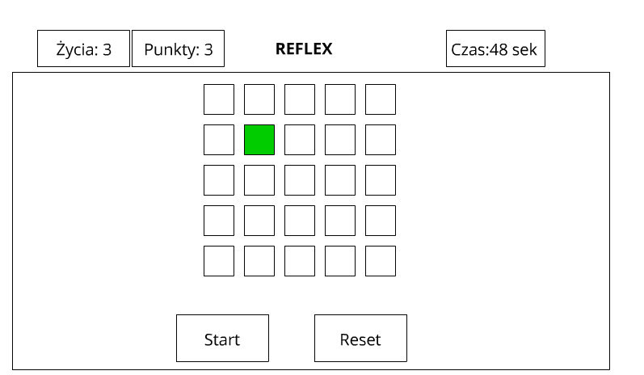

# Zadanie rekrutacyjne - JavaScript

### Zadanie polega na stworzeniu w JS gry „Reflex”

##### Uwagi ogólne

- dodatkowo punktowana będzie przemyślana organizacja kodu (np. podzielenie go na moduły, klasy itp. zamiast zastosowania jednej, „wszystkorobiącej” funkcji)
- nie należy korzystać z żadnych zewnętrznych bibliotek (wyjątkiem, lecz nie wymogiem, jest Bootstrap)
- nie należy korzystać z żadnych frameworków
- mile widziane użycie TypeScript
- odpowiedzi prosimy przesyłać w formie linku do repozytorium

##### Wytyczne

1.  Gra rozpoczyna się od wciśnięcia przycisku ”Start”
2.  Rozgrywka trwa 60 sekund lub do straty ostatniego życia (gracz ma trzy „życia”)
3.  Czas widoczny w prawym górnym rogu
4.  Na środku gry wyświetlone są kwadraty (liczba podawana z parametru)
5.  Co 3 sekundy losowo wybrany kwadrat zapala się na zielono
6.  Kwadrat jest zapalony na zielono przez 2 sekundy i w tym czasie gracz musi go kliknąć
7.  Jeśli graczowi uda się kliknąć zielony kwadrat, dostaje 1 punkt
8.  Gracz traci życie, jeśli w trafi w inny kwadrat lub jeśli podświetlenie zielonego kwadratu zniknie po 2 sekundach. Pojawia się alert „straciłeś życie”
9.  Grę można zresetować – wyzerowany zostaje licznik czasu i punktów, a licznik „życia” wraca do stanu początkowego (np. 3)

##### Rysunek poglądowy

